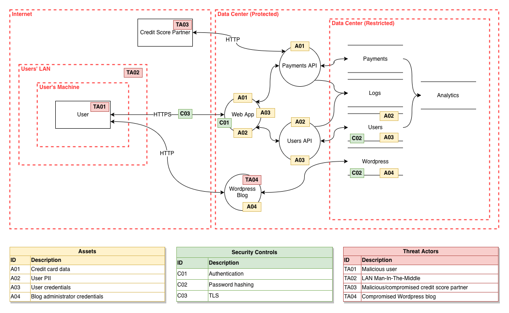
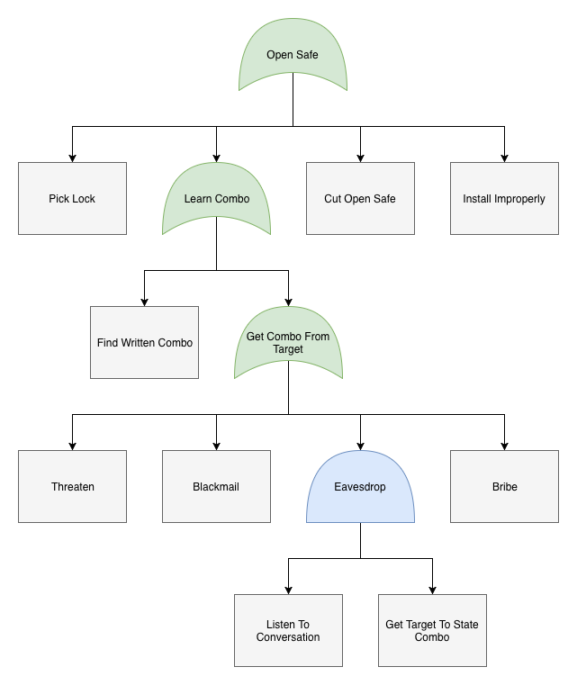

# Draw.io libraries for threat modeling

This is a collection of custom libraries to turn the free and cross-platform [Draw.io] diagramming application into the perfect tool for threat modeling.

## Data Flow Diagrams

[Data Flow Diagramming] is a simple diagramming technique used to gain an understanding of how data flows in an application or system. DFDs are excellent for getting a bird's-eye view of a system to facilitate threat modeling.

## Attack Trees

[Attack Trees] are another kind of diagramming method that is great for exploring how a threat actor might attain a specific goal, or how an asset might be attacked.

## Installation

1. [Download] and install draw.io for your operating system
2. Clone or download this repository
3. Open draw.io application and create a new blank diagram
4. Click the *File* menu and then click *Open Library...*
5. Navigate to where you put this project and open one of the xml files
6. Start diagramming!

[Draw.io]: https://www.draw.io/
[Data Flow Diagramming]: https://en.wikipedia.org/wiki/Data_flow_diagram
[Attack Trees]: https://en.wikipedia.org/wiki/Attack_tree
[Download]: https://about.draw.io/integrations/#integrations_offline

